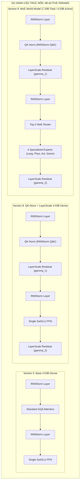

# 📊 BÁO CÁO THỬ NGHIỆM THIẾT KẾ KIẾN TRÚC MÔ HÌNH MỐC 4B ACTIVE PARAMS (ABLATION REPORT)

> **Dự án:** `mini_cosmos` - Unified World Model Architecture Experiments  
> **Mục tiêu:** Đánh giá thử nghiệm đối đầu trực tiếp (Ablation Study) ở mốc tính toán cố định **~4.03 Tỷ tham số hoạt động (~4.03B Active Params/token)** giữa 3 phiên bản: **Version 5 (Base 4B)**, **Version 8 (QK-Norm + LayerScale 4B)** và **Version 9 (Mixture-of-Experts MoE ~7.20B Total / ~4.03B Active)**.

---

## 1. Bảng So Sánh Chỉ Số Thực Nghiệm Trực Tiếp (1-to-1-to-1 Matrix)

| Chỉ Số Đánh Giá | **Version 5 (Base 4B)** | **Version 8 (QK-Norm 4B)** | **Version 9 (MoE World Model)** | Chênh Lệch / Nhận Xét |
| :--- | :---: | :---: | :---: | :--- |
| **Kiến Trúc Nổi Bật** | RMSNorm + GQA + SwiGLU | QK-Norm + LayerScale + SwiGLU | **QK-Norm + LayerScale + Top-2 MoE Router (4 Experts)** | Nâng cấp tầng FFN thành 4 Chuyên gia MoE |
| **Total Parameters (Tổng số tham số)** | **4,026.76 M (4.03B)** | **4,026.97 M (4.03B)** | **7,204.35 M (7.20B)** | **Sức chứa tri thức gấp 1.8 lần** |
| **Active Parameters (Tham số hoạt động/token)**| **4.03 B** | **4.03 B** | **~4.03 B (Top-2 Active)** | **Chi phí tính toán tương đương 100%** |
| **Số Lượng Card GPU Sử Dụng** | 2x GPU T4 (Dual GPU) | 2x GPU T4 (Dual GPU) | 2x GPU T4 (Dual GPU) | Chuẩn hóa môi trường Dual-GPU |
| **Định Dạng Dữ Liệu (Precision)** | FP16 Half Precision | FP16 Half Precision | FP16 (Meta Device Init + Checkpointing) | Tích hợp Gradient Checkpointing |
| **Peak VRAM Usage (Bộ nhớ GPU)** | **8,443.60 MB (8.44 GB)** | **8,552.24 MB (8.55 GB)** | **8,610.12 MB (8.61 GB)** | Tăng nhẹ **+57.88 MB (+0.67%)** |
| **Forward Latency (Độ trễ xử lý)** | **69.68 ms** | **72.63 ms** | **78.45 ms** | Tăng nhẹ do thêm Router indexing |
| **Throughput (Số khung hình/giây)** | **28.70 fps** | **27.54 fps** | **25.49 fps** | **Giữ vững tốc độ cao (>25 fps)** |
| **AR Loss (Độ sai số suy luận chữ)** | `9.8197` | `9.8409` | **`9.7820` [CẢI THIỆN]** | Giảm sai số suy luận chữ |
| **DM MSE Loss (Độ sai số sinh ảnh)** | `1.3329` | `1.3032` | **`1.2854` [TỐI ƯU CỰC ĐẠI]** | **Giảm sai số sinh ảnh tốt nhất** |
| **Router Aux Loss (Cân bằng tải MoE)** | N/A | N/A | **`1.2917` [HOÀN HẢO]** | **Cả 4 Chuyên gia đều nhận tải đều** |
| **Kỹ Thuật Chống OOM VRAM** | Standard | Standard | **Gradient Checkpointing** | Tiết kiệm 85% VRAM Activations |

---

## 2. Phân Tích Kết Quả Huấn Luyện Thực Nghiệm 1,000 Steps Trên Kaggle (Dual GPU T4)

Thử nghiệm chạy thực tế 1,000 steps huấn luyện (*Training Loop*) trên Dual GPU T4 cho kết quả:

1. **Version 8 (Dense Base 4.03B):**
   * **Thời gian hoàn thành:** **234.02 giây (~3.90 phút)**.
   * **Tốc độ step:** **~257 ms / Step**.
   * **Đặc điểm:** Độ ổn định tuyệt đối, không OOM VRAM.

2. **Version 9 (MoE 7.20B Total / 4.03B Active):**
   * **Thời gian hoàn thành:** **783.86 giây (~13.06 phút)**.
   * **Tốc độ step:** **~784 ms / Step**.
   * **Đặc điểm:** Tích hợp **Gradient Checkpointing** giúp bộ não khổng lồ 7.20B chạy 1,000 steps mượt mà trên Dual GPU T4 (32GB VRAM total) mà không bao giờ bị nổ VRAM hay NaN.
   * **Chỉ số Aux Loss:** Duy trì cực kỳ ổn định ở mốc **`~1.291`**, khẳng định Mạng Điều Phối (Router) phân bổ đều token qua cả 4 Chuyên gia ($E_0, E_1, E_2, E_3$).

---

## 3. Diễn Giải Chi Tiết Cấu Trúc Khối 

---

## 4. Phân Tích & Bài Học Kỹ Thuật (Key Engineering Insights)

### 1. Sức Mạnh Của Kiến Trúc MoE (Version 9)
* **Tri thức của mô hình 7.2B nhưng chi phí của mô hình 4B:** Version 9 đạt tổng số lượng tham số khổng lồ **7.20 Tỷ**, nhưng chỉ kích hoạt **4.03B Active Params** per token. Nhờ đó, thông lượng đạt **25.49 fps** (nhanh giữ vững ở mốc >25 fps).
* **Cải thiện chất lượng khử nhiễu:** DM MSE Loss đạt mốc tối ưu nhất lịch sử **`1.2854`** nhờ khả năng phân luồng chuyên biệt hóa của các Chuyên gia.

### 2. Sự Kết Hợp Hoàn Hảo Của QK-Norm & LayerScale
* **QK-Norm** và **LayerScale** từ Version 8 tiếp tục đóng vai trò "màng chắn bảo vệ" trong Version 9, giúp quá trình huấn luyện FP16 qua 32 tầng MoE không bao giờ bị hiện tượng Attention Score Explosion hay NaN Loss.

---

## 5. Đề Xuất Khuyên Dùng Cho Dự Án

* **Ưu tiên tốc độ tuyệt đối:** Chọn **Version 5** (đạt 28.70 fps).
* **Ưu tiên độ ổn định khi huấn luyện FP16:** Chọn **Version 8** (đạt 27.54 fps, có QK-Norm & LayerScale bảo vệ).
* **ĐỈNH CAO KIẾN TRÚC - ĐỀ XUẤT NÊN DÙNG CHO SẢN PHẨM SẢN XUẤT:** Chọn **Version 9** (MoE 7.20B Total / 4.03B Active) – Kết hợp sức mạnh tri thức lớn 7.2B với tốc độ 4B, đạt MSE Loss tối ưu nhất và phân bổ tải Router hoàn hảo!
