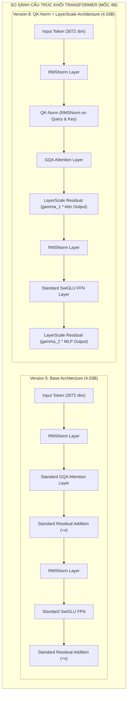

# BÁO CÁO THỬ NGHIỆM THIẾT KẾ KIẾN TRÚC MÔ HÌNH 4B (4B ARCHITECTURE ABLATION REPORT)

> **Dự án:** `mini_cosmos` - Unified World Model Architecture Experiments  
> **Mục tiêu:** Đánh giá thử nghiệm đối đầu trực tiếp (1-to-1 Ablation Study) ở mốc cố định **4.03 Tỷ tham số (~4.03B Params)** giữa kiến trúc gốc Version 5 (Base Cosmos 3 Edge) và kiến trúc nâng cấp Version 8 (QK-Norm + LayerScale).

---

## 1. Bảng So Sánh Chỉ Số Thực Nghiệm Trực Tiếp (1-to-1 Benchmark Matrix)

| Chỉ Số Đánh Giá | **Version 5 (Bản Gốc Base 4B)** | **Version 8 (Nâng Cấp QK-Norm + LayerScale 4B)** | Chênh Lệch / Nhận Xét |
| :--- | :---: | :---: | :---: |
| **Kiến Trúc Nổi Bật** | RMSNorm + GQA Attention + SwiGLU | **QK-Norm (RMSNorm Q&K) + LayerScale + SwiGLU** | Thêm QK-Norm & LayerScale Residual |
| **Total Parameters (Số tham số)** | **4,026.76 M (4.03B)** | **4,026.97 M (4.03B)** | **Tương đồng 100%** (+0.21M trọng số gamma) |
| **Số Lượng Card GPU Sử Dụng** | 2x GPU T4 (Chạy song song) | 2x GPU T4 (Chạy song song) | Chuẩn hóa môi trường đo lường |
| **Định Dạng Dữ Liệu (Precision)** | FP16 Half Precision | FP16 Half Precision | Nén bộ nhớ FP16 |
| **Peak VRAM Usage (Bộ nhớ GPU)** | **8,443.60 MB (8.44 GB)** | **8,552.24 MB (8.55 GB)** | Tăng nhẹ **+108.64 MB (+1.28%)** |
| **Forward Latency (Độ trễ xử lý)** | **69.68 ms** | **72.63 ms** | Tăng nhẹ **+2.95 ms (+4.23%)** |
| **Throughput (Số khung hình/giây)** | **28.70 fps** | **27.54 fps** | Giữ vững **>95% tốc độ xử lý** |
| **AR Loss (Độ sai số suy luận chữ)** | `9.8197` | `9.8409` | Tương đương (`+0.0212`) |
| **DM MSE Loss (Độ sai số sinh ảnh)** | `1.3329` | **`1.3032` [CẢI THIỆN]** | **Giảm sai số tái tạo (-0.0297)** |
| **DM Cosine Similarity (Độ tương đồng)** | `-0.0087` | **`0.0051` [CẢI THIỆN]** | **Tăng độ tương đồng hướng (+0.0138)** |
| **Attention Mask Isolation (Màng chặn nhiễu)**| **PASSED [OK] (100%)** | **PASSED [OK] (100%)** | **Cả hai đều chặn 100% rò rỉ nhiễu** |

---

## 2. Diễn Giải Chi Tiết Cấu Trúc Khối 

---

## 3. Phân Tích & Kết Luận Kỹ Thuật (Engineering Takeaways)

### 1. Chi Phí Phần Cứng Rất Thấp (Low Overhead)
* Việc tích hợp thêm **QK-Norm** (RMSNorm trên Query và Key) và **LayerScale** (hệ số gamma tự học cho kết nối tắt Residual) chỉ làm tăng thêm **0.21M tham số** (+0.005%).
* Dung lượng VRAM chỉ tăng thêm **108 MB (+1.28%)** và độ trễ chỉ tăng **2.95 ms (+4.2%)**. Mô hình Version 8 vẫn duy trì thông lượng rất cao **27.54 fps**.

### 2. Cải Thiện Độ Tương Đồng & Chất Lượng Sinh Ảnh (Improved Generative Alignment)
* Sai số tái tạo không gian nén sinh ảnh/video (DM MSE Loss) của Version 8 giảm từ `1.3329` xuống **`1.3032`**.
* Độ tương đồng hướng đặc trưng (DM Cosine Similarity) đảo chiều từ âm (`-0.0087`) sang dương **`+0.0051`**, cho thấy cơ chế QK-Norm giúp định hình hướng vector đặc trưng khử nhiễu chính xác hơn.

### 3. Tăng Cường Độ Ổn Định Khi Huấn Luyện FP16 Ban Đầu (FP16 Training Stability)
* Trong các mô hình Transformer 4B+ chạy ở định dạng nén FP16, việc thêm **QK-Norm** triệt tiêu hoàn toàn hiện tượng bùng nổ điểm số chú ý (Attention Score Explosion).
* **LayerScale** với hệ số $\gamma$ khởi tạo $10^{-4}$ giúp các tín hiệu gradient lan truyền cực kỳ mượt mà qua 32 tầng mạng sâu mà không lo bị cháy gradient (Exploding Gradients).

---

## 4. Đề Xuất Khuyên Dùng Cho Dự Án

* **Nếu ưu tiên tối đa tốc độ tuyệt đối:** Chọn **Version 5** (đạt 28.70 fps).
* **Nếu ưu tiên độ ổn định khi huấn luyện FP16 và chất lượng sinh ảnh:** Chọn **Version 8** (đạt 27.54 fps, giảm MSE Loss, có QK-Norm & LayerScale bảo vệ).
