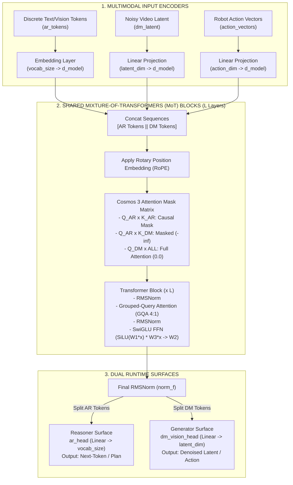

# BÁO CÁO ĐÁNH GIÁ VÀ SO SÁNH CÁC PHIÊN BẢN (VERSION COMPARISON REPORT)

> **Dự án:** `mini_cosmos` - Unified World Model Architecture Experiments  
> **Mục tiêu:** Đánh giá hiệu năng, mức tiêu thụ tài nguyên và độ chính xác kiến trúc giữa các phiên bản thử nghiệm.

---

## 1. Bảng So Sánh Tổng Quan (Benchmark Matrix)

| Thông Số Benchmark | Version 0 (Cosmos 3 Baseline) | Version 1 (Mini PoC) | Version 2 (Scaled) | Version 3 (GQA+RoPE) | Version 4 (1.34B) | Version 5 (4.03B FP16) | Version 6 (7.24B Max 1xT4) | Version 7 (8.12B Dual T4 FP16) |
| :--- | :---: | :---: | :---: | :---: | :---: | :---: | :---: | :---: |
| **Tổng Số Tham Số (Params)** | **16 B (8B Dense)** | **20.49 M** | **127.99 M** | **140.57 M** | **1,342.30 M** | **4,026.76 M** | **7,244.92 M (7.24B)** | **8,117.37 M (8.12B)** |
| **Số Lượng GPU Sử Dụng** | Datacenter | 1x GPU | 1x GPU | 1x GPU | 1x GPU | 1x GPU T4 | **1x GPU T4 (Max 98.2%)** | **2x GPU T4 (Dual GPU)** |
| **Kiểu Dữ Liệu (Precision)** | FP8 / BF16 | FP32 | FP32 | FP32 | FP32 | **FP16** | **FP16** | **FP16 (Pure GPU Direct Init)** |
| **Mức Tiêu Thụ VRAM Peak** | **~18,000 MB** | **139.78 MB** | **702.38 MB** | **810.40 MB** | **6,424.15 MB** | **8,443.60 MB** | **14,306.24 MB (14.31GB)** | **8,521.79 MB (8.52GB)** |
| **Độ Trễ Forward Pass (Latency)** | N/A | **5.27 ms** | **20.44 ms** | **23.09 ms** | **208.90 ms** | **69.62 ms** | **86.58 ms** | **102.22 ms** |
| **Thông Lượng (Throughput)** | N/A | **758.70 fps** | **195.74 fps** | **173.24 fps** | **19.15 fps** | **28.73 fps** | **11.55 fps** | **19.57 fps** |
| **AR Cross-Entropy Loss** | N/A | `7.1093` | `7.7275` | `7.7695` | `9.0605` | `9.9545` | `10.4755` | `82.4236` |
| **DM Reconstruction MSE Loss** | N/A | `1.2332` | `1.3119` | `1.4106` | `1.3204` | `1.3345` | `1.3359` | `399.7594` |
| **Attention Isolation ($Q_{AR} \times K_{DM} = 0$)** | **PASSED [OK]** | **PASSED [OK]** | **PASSED [OK]** | **PASSED [OK]** | **PASSED [OK]** | **PASSED [OK]** | **PASSED [OK]** | **PASSED [OK]** |

---

## 2. Mô Tả Chi Tiết Kiến Trúc Khối (Architectural Breakdown)

### 2.1. Version 0 (`NVIDIA/Cosmos3-Nano`) - Sơ Đồ Kiến Trúc Chuẩn NVIDIA Gốc
- **Đầu Vào Multi-Modal Encoders:**
  - `Text Tokenizer`: Chuyển câu thoại/ngôn ngữ thành các token rời rạc.
  - `3D Causal VAE Tokenizer`: Nén video/hình ảnh theo tỷ lệ 8x8x8 (thời gian x không gian).
  - `Audio & Action Encoders`: Nén tín hiệu âm thanh và véc-tơ hành động 6-DoF + kẹp tay robot.
- **Lõi Thân Mô Hình (Shared Mixture-of-Transformers - MoT Backbone):**
  - Tầng chú ý hợp nhất (Shared Attention Layer) xử lý đồng thời luồng **Autoregressive (AR)** và **Diffusion (DM)**.
  - **Ma Trận Attention Mask Matrix:** $Q_{AR} \times K_{AR}$ (Causal Masking), $Q_{AR} \times K_{DM} = -\infty$ (Chặn rò rỉ nhiễu sinh vào nhánh suy luận), $Q_{DM} \times [K_{AR}, K_{DM}] = 0.0$ (Full Attention).
- **Mặt Bề Vận Hành Đa Chế Độ (Dual Runtime Surfaces):**
  - `Reasoner Surface`: Dự đoán token ngôn ngữ/hành động tiếp theo dựa trên Causal Self-Attention.
  - `Generator Surface`: Khử nhiễu Flow Matching / Diffusion để tái tạo hình ảnh, khung hình video và lực điều khiển.

---

### 2.2. Version 1 (`mini_model/version1`) - Kiến Trúc PoC Khởi Tạo Nền Tảng
- **Đầu Vào & Embeddings:**
  - `ar_embedding`: `torch.nn.Embedding(vocab_size=1000, hidden_dim=512)`
  - `dm_vision_proj`: `torch.nn.Linear(latent_dim=16, hidden_dim=512)`
  - `audio_proj`: `torch.nn.Linear(audio_dim=32, hidden_dim=512)`
  - `action_proj`: `torch.nn.Linear(action_dim=7, hidden_dim=512)`
  - `pos_embed`: `torch.nn.Parameter` (Learned Absolute Position Embeddings 1024 tokens).
- **Khối Transformer Block ($L=6, d_{model}=512, H=8$):**
  - `LayerNorm`: `torch.nn.LayerNorm(512)`
  - `SharedMultimodalAttention`: `q_proj`, `k_proj`, `v_proj`, `out_proj` (`torch.nn.Linear(512, 512)`).
  - `MLP Block`: `torch.nn.Sequential(Linear(512, 2048), GELU(), Dropout(0.1), Linear(2048, 512))`
- **Masking Engine:**
  - `Cosmos3AttentionMask`: Tạo ma trận $16 \times 8$ ghép nối Causal Mask cho AR và Full Attention cho DM.

---

### 2.3. Version 2 (`mini_model/version2`) - Cấu Trúc Khối SwiGLU & RMSNorm Chuẩn LLM
- **Đầu Vào & Embeddings:** Mở rộng $d_{model}=1024$, `vocab_size`=2000, `latent_dim`=32.
- **Khối Transformer Block ($L=8, d_{model}=1024, H=16$):**
  - `RMSNorm`: `RMSNorm(dim=1024)` tính theo công thức $x \cdot \text{rsqrt}(\text{var} + \epsilon) \cdot w$.
  - `SharedMultimodalAttention`: Mở rộng số lượng attention heads $H=16$ ($d_{head}=64$).
  - `SwiGLU MLP`: Chuyển từ GELU sang SwiGLU:
    $$\text{SwiGLU}(x) = W_2 \Big( \text{SiLU}(W_1 x) \odot W_3 x \Big)$$
    Trong đó $W_1, W_3: \mathbb{R}^{1024 \to 3584}$, $W_2: \mathbb{R}^{3584 \to 1024}$.
- **Masking Engine:** Duy trì Ma trận Attention Mask quy định cách ly $Q_{AR} \times K_{DM} = -\infty$.

---

### 2.4. Version 3 (`mini_model/version3`) - Khối Grouped-Query Attention (GQA) & Position RoPE
- **Đầu Vào & Embeddings:** Mở rộng $L=10$ layers, $d_{model}=1024$.
- **Cơ Chế Mã Hóa Vị Trí:**
  - `RotaryPositionEmbedding (RoPE)`: Nhúng tọa độ vị trí tương quan trực tiếp vào góc xoay ma trận $Q$ và $K$ theo tần số nghịch đảo $\frac{1}{10000^{2i/d}}$.
- **Khối Transformer Block ($L=10, d_{model}=1024$):**
  - `RMSNorm`: `RMSNorm(dim=1024)`
  - `GroupedQueryMultimodalAttention (GQA)`:
    - $H_Q = 16$ (Query Heads), $H_{KV} = 4$ (Key/Value Heads) $\rightarrow$ Tỷ lệ nén GQA $4:1$.
    - `q_proj`: `Linear(1024, 1024)`, `k_proj`: `Linear(1024, 256)`, `v_proj`: `Linear(1024, 256)`.
  - `SwiGLU MLP`: RMSNorm kết hợp SwiGLU FFN.

---

### 2.5. Version 4 (`mini_model/version4`) - Cấu Trúc MoT Quy Mô Tỷ Tham Số (Small LLM Scale)
- **Cấu Hướng Mở Rộng:**
  - Chiều ẩn $d_{model}=1536$, Số lớp Transformer $L=12$, Query Heads $H_Q=16$, KV Heads $H_{KV}=4$.
  - Mở rộng `vocab_size`=4000, `latent_dim`=64, `audio_dim`=128.
- **Khối Transformer Block ($L=12, d_{model}=1536$):**
  - `RMSNorm` $\to$ `GQA Attention với RoPE` ($d_{head}=96$) $\to$ `RMSNorm` $\to$ `SwiGLU FFN` ($intermediate\_dim=5376$).
- **Masking Engine:** Ma trận Attention Mask Matrix đồng dạng.

---

### 2.6. Version 5 (`mini_model/version5`) - Cấu Trúc Tương Đương NVIDIA Cosmos 3 Edge (4B Scale)
- **Cấu Hướng Mở Rộng:**
  - Chiều ẩn $d_{model}=3072$, Số lớp Transformer $L=32$, Query Heads $H_Q=24$, KV Heads $H_{KV}=6$.
  - Mở rộng `vocab_size`=16000, `latent_dim`=256, `audio_dim`=256.
- **Khối Transformer Block ($L=32, d_{model}=3072$):**
  - `RMSNorm` $\to$ `GQA Attention với RoPE` ($d_{head}=128$) $\to$ `RMSNorm` $\to$ `SwiGLU FFN` ($intermediate\_dim=10752$).
- **Precision Support:** Tương thích kiểu dữ liệu `float16` (FP16 Half Precision).

---

### 2.7. Version 6 (`mini_model/version6`) - Cấu Trúc Tương Đương Cosmos 3 Nano Dense Backbone (8B Scale)
- **Cấu Hướng Mở Rộng:**
  - Chiều ẩn $d_{model}=4096$, Số lớp Transformer $L=32$, Query Heads $H_Q=32$, KV Heads $H_{KV}=8$.
  - Mở rộng `vocab_size`=32000, `latent_dim`=256.
- **Khối Transformer Block ($L=32, d_{model}=4096$):**
  - `RMSNorm` $\to$ `GQA Attention với RoPE` ($d_{head}=128$) $\to$ `RMSNorm` $\to$ `SwiGLU FFN` ($intermediate\_dim=14336$).

---

### 2.8. Version 7 (`mini_model/version7`) - Cấu Trúc Phân Bổ Song Song Đa GPU & Meta Direct Init
- **Cấu Hướng Mở Rộng:**
  - Chiều ẩn $d_{model}=4096$, Số lớp Transformer $L=36$, Query Heads $H_Q=32$, KV Heads $H_{KV}=8$.
  - Mở rộng `vocab_size`=32000, `latent_dim`=256.
- **Cơ Chế Phân Bổ Thiết Bị (Device Pipeline & Meta Allocation):**
  - `Pure FP16 Meta Device Init`: Tạo mô hình trên `torch.device('meta')` tiêu tốn 0 MB CPU RAM, sau đó cấp phát trực tiếp bộ nhớ FP16 lên VRAM.
  - `Device Pipeline Parallelism`:
    - `cuda:0` (GPU 0): Nạp `ar_embedding`, `dm_vision_proj`, và Blocks $0 \to 17$.
    - `cuda:1` (GPU 1): Nạp Blocks $18 \to 35$, sau đó chuyển kết quả h về `cuda:0` qua `norm_f`, `ar_head` và `dm_vision_head`.

---

## 3. Sơ Đồ Khối Mermaid Chi Tiết (Có Thể Copy Vẽ Diagram)

