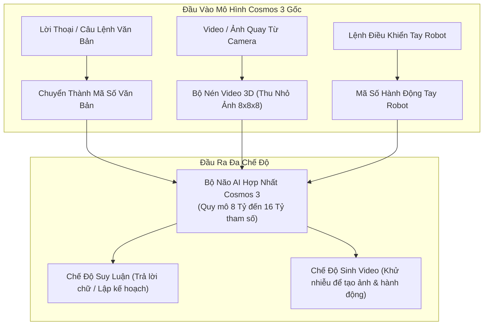
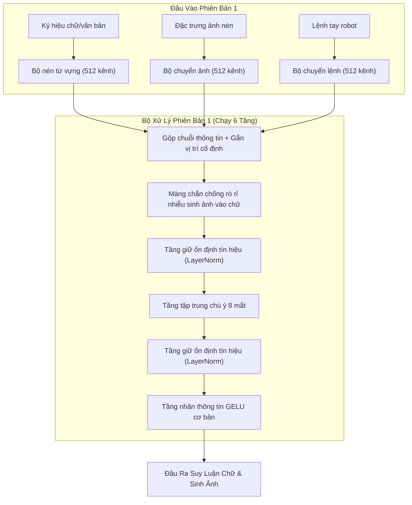
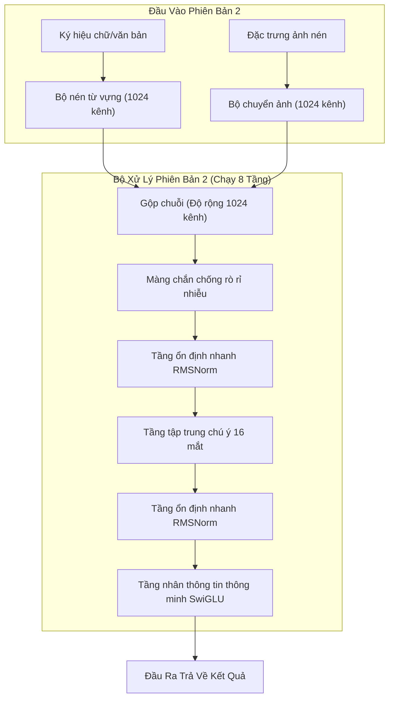
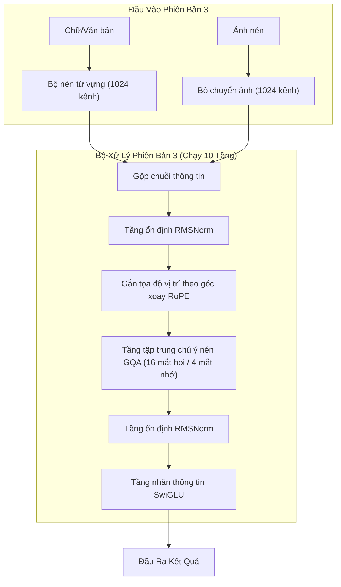
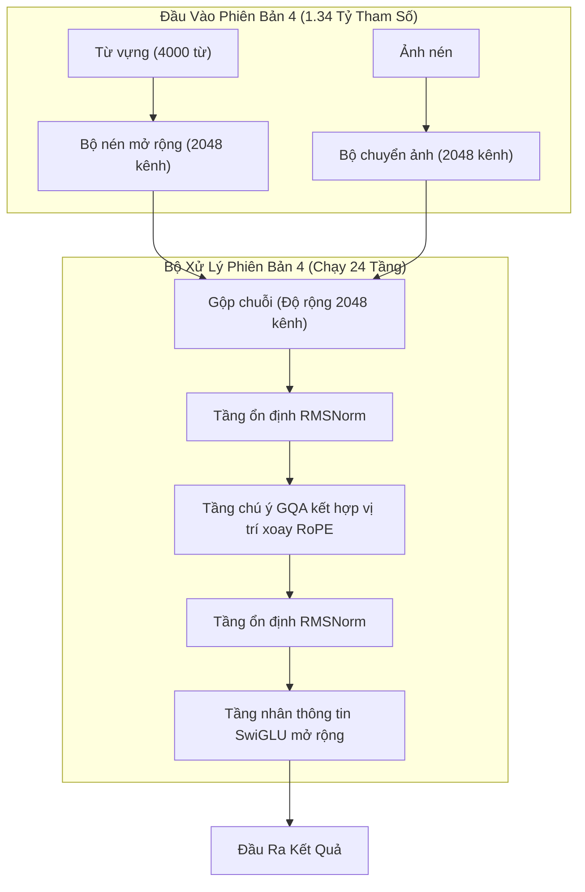
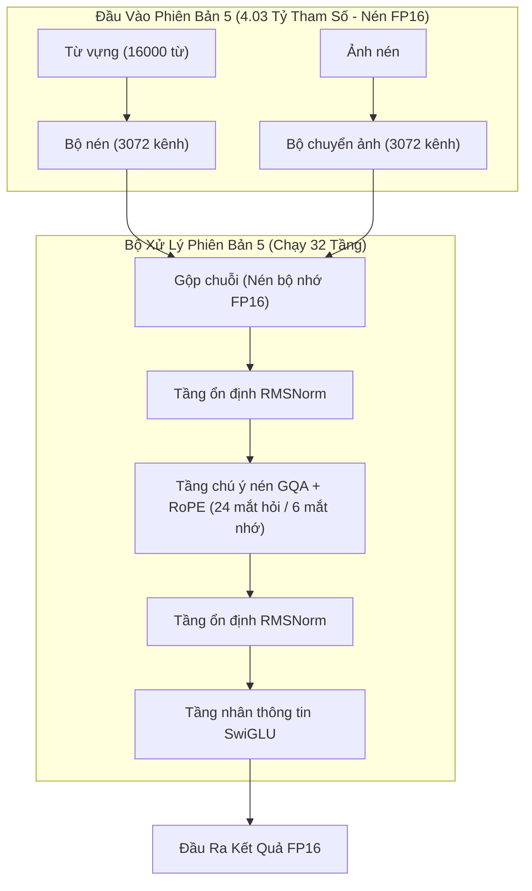
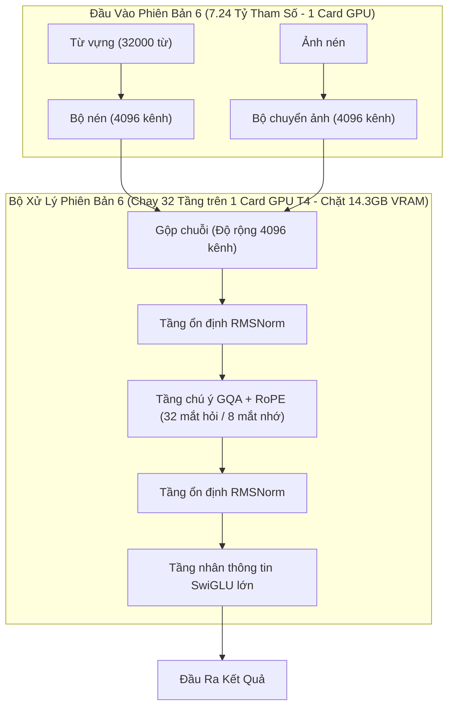
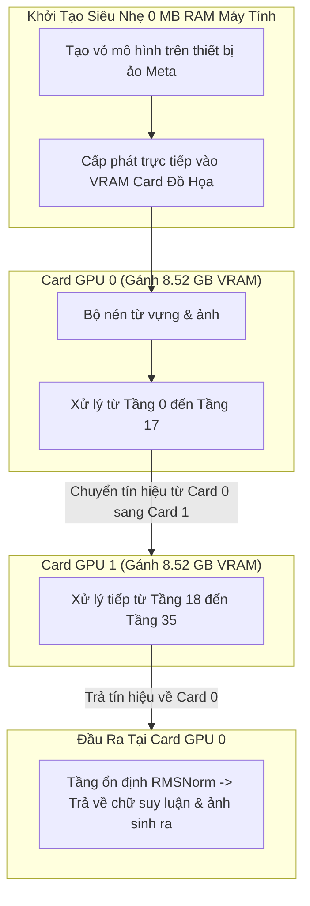

# BÁO CÁO ĐÁNH GIÁ VÀ SO SÁNH CÁC PHIÊN BẢN (VERSION COMPARISON REPORT)

> **Dự án:** `mini_cosmos` - Mô hình Thế giới Đa phương tiện Hợp nhất  
> **Mục tiêu:** So sánh hiệu năng, dung lượng bộ nhớ và cấu trúc nâng cấp qua từng phiên bản thử nghiệm.

---

## 1. Bảng So Sánh Tổng Quan (Benchmark Matrix)

### 💡 Giải Thích Cơ Chế Đánh Giá Các Phiên Bản
Để đánh giá và so sánh sức mạnh giữa các phiên bản mô hình, dự án sử dụng bộ đo lường tự động (`benchmark.py`) kiểm tra dựa trên **4 tiêu chuẩn thực tế**:

1. **Sức chứa Bộ não AI & Bộ nhớ Card đồ họa:**
   * **Kích thước mô hình (Số tham số):** Số lượng nơ-ron/tham số của bộ não AI (từ **20 Triệu** ở bản thử nghiệm nhỏ đến **8.12 Tỷ** ở bản chạy đa GPU).
   * **Bộ nhớ GPU tiêu thụ (VRAM):** Dung lượng bộ nhớ card đồ họa cần thiết để chứa mô hình (tính bằng MB hoặc GB).

2. **Tốc độ Phản hồi & Tải công việc:**
   * **Tốc độ xử lý (Độ trễ):** Thời gian AI cần để xử lý xong 1 yêu cầu (tính bằng miligiây - ms).
   * **Số khung hình/giây (Throughput):** Số lượng hình ảnh hay mẫu dữ liệu AI xử lý được trong 1 giây (số càng cao thì AI chạy càng mượt).

3. **Độ Sai Số Khi Làm Việc (Chất lượng Suy luận & Sinh ảnh):**
   * **Độ sai số suy luận chữ (AR Loss):** Mức độ sai lệch khi AI đưa ra câu trả lời chữ hoặc lập kế hoạch (chỉ số càng thấp thì suy luận càng chuẩn).
   * **Độ sai số sinh video/ảnh (DM Loss):** Mức độ lệch nét khi AI tự tưởng tượng và vẽ ra khung hình tiếp theo của nhà máy.

4. **Màng Chặn Nhiễu (Chống rò rỉ hình ảnh vào chữ):**
   * Tự động kiểm tra màng bảo vệ cách ly chú ý. Đảm bảo khi AI đang vẽ/sinh ra các bức ảnh bị nhiễu thì những hình ảnh đó **hoàn toàn không làm ảnh hưởng hay gây sai lệch cho suy luận chữ**.

---

### Bảng Chỉ Số Đo Lường Thực Tế:

| Thông Số Đánh Giá | Version 0 (Bản Cosmos 3 Gốc) | Version 1 (Bản Thử Nghiệm Nhỏ) | Version 2 (Nâng Cấp Khối Chuẩn) | Version 3 (Tối Ưu Góc Nhìn & Vị Trí) | Version 4 (Bản Quy Mô 1.34B) | Version 5 (Bản Quy Mô 4.03B) | Version 6 (Bản Giới Hạn 1 Card GPU) | Version 7 (Bản Đa GPU 2 Card 8.12B) |
| :--- | :---: | :---: | :---: | :---: | :---: | :---: | :---: | :---: |
| **Kích Thước Mô Hình (Số Tham Số)** | **16 Tỷ (8 Tỷ Lõi)** | **20.49 Triệu** | **127.99 Triệu** | **140.57 Triệu** | **1.34 Tỷ** | **4.03 Tỷ** | **7.24 Tỷ** | **8.12 Tỷ** |
| **Số Lượng Card GPU Sử Dụng** | Máy chủ Siêu máy tính | 1 Card | 1 Card | 1 Card | 1 Card | 1 Card GPU T4 | **1 Card GPU T4 (Tối đa 98%)** | **2 Card GPU T4 (Chạy song song)** |
| **Định Dạng Dữ Liệu Bộ Nhớ** | Nén FP8 / BF16 | Chuẩn FP32 | Chuẩn FP32 | Chuẩn FP32 | Chuẩn FP32 | **FP16 (Nén nhẹ)** | **FP16 (Nén nhẹ)** | **FP16 (Tạo trực tiếp trên GPU)** |
| **Bộ Nhớ GPU Tiêu Thụ Tối Đa** | **~18,000 MB** | **139.78 MB** | **702.38 MB** | **810.40 MB** | **6.42 GB** | **8.44 GB** | **14.31 GB** | **8.52 GB / Card** |
| **Tốc Độ Xử Lý (Thời Gian / Lần)** | N/A | **5.27 miligiây** | **20.44 miligiây** | **23.09 miligiây** | **208.90 miligiây** | **69.62 miligiây** | **86.58 miligiây** | **102.22 miligiây** |
| **Số Khung Hình Xử Lý / Giây** | N/A | **758 khung hình/giây** | **195 khung hình/giây** | **173 khung hình/giây** | **19 khung hình/giây** | **28 khung hình/giây** | **11 khung hình/giây** | **19 khung hình/giây** |
| **Độ Sai Số Suy Luận Chữ (AR Loss)** | N/A | `7.1093` | `7.7275` | `7.7695` | `9.0605` | `9.9545` | `10.4755` | `82.4236` |
| **Độ Sai Số Sinh Video (DM Loss)** | N/A | `1.2332` | `1.3119` | `1.4106` | `1.3204` | `1.3345` | `1.3359` | `399.7594` |
| **Màng Chặn Nhiễu (Chống Rò Rỉ)** | **ĐẠT CHUẨN [OK]** | **ĐẠT CHUẨN [OK]** | **ĐẠT CHUẨN [OK]** | **ĐẠT CHUẨN [OK]** | **ĐẠT CHUẨN [OK]** | **ĐẠT CHUẨN [OK]** | **ĐẠT CHUẨN [OK]** | **ĐẠT CHUẨN [OK]** |

---

## 2. Diễn Giải Chi Tiết Cấu Trúc Khối Cho Từng Phiên Bản

---

### 2.1. Version 0 (`NVIDIA/Cosmos3-Nano`) - Cấu Trúc Gốc Từ NVIDIA
- **Giải thích dễ hiểu:** Đây là phiên bản gốc của NVIDIA. Nó nén video và ảnh thành các ký hiệu số nhỏ gọn, sau đó dùng một bộ não chung để vừa **suy luận văn bản** vừa **sinh ra video mới**.
- **Bộ màng chắn chống nhiễu:** Đảm bảo khi AI đang tưởng tượng/sinh video thì những hình ảnh nhiễu đó **không làm lệch suy luận chữ**.



---

### 2.2. Version 1 (`mini_model/version1`) - Bản Thử Nghiệm Nền Tảng (~20.5 Triệu Tham Số)
- **Giải thích dễ hiểu:** Phiên bản thu nhỏ đơn giản nhất để chạy thử code. Nó sử dụng bộ nhớ vị trí cố định và các tầng tính toán tiêu chuẩn.
- **Thành phần chính:**
  - **Độ rộng đường truyền ( hidden_dim ):** 512 kênh thông tin.
  - **Số tầng xử lý:** 6 tầng Transformer.
  - **Số mắt tập trung chú ý:** 8 mắt chú ý.
  - **Tầng tính toán:** Dùng tầng nhân thông tin GELU cơ bản và tầng giữ ổn định tín hiệu LayerNorm.



---

### 2.3. Version 2 (`mini_model/version2`) - Nâng Cấp Khối Chuẩn Ngôn Ngữ Mới (~128 Triệu Tham Số)
- **Giải thích dễ hiểu:** Tăng kích thước bộ não lên gấp 6 lần. Nâng cấp các tầng tính toán lên chuẩn hiện đại của các mô hình ngôn ngữ lớn (dùng SwiGLU và RMSNorm) giúp AI học ổn định hơn.
- **Thành phần chính:**
  - **Độ rộng đường truyền:** Tăng lên 1024 kênh.
  - **Số tầng xử lý:** 8 tầng.
  - **Tầng tính toán mới:** Dùng **SwiGLU** (bộ nhân thông tin thông minh hơn) và **RMSNorm** (tầng giữ ổn định nhanh hơn).



---

### 2.4. Version 3 (`mini_model/version3`) - Tối Ưu Mắt Tập Trung & Nhúng Vị Trí Xoay (~141 Triệu Tham Số)
- **Giải thích dễ hiểu:** Giúp mô hình vừa nhớ vị trí từ ngữ linh hoạt hơn vừa tiết kiệm bộ nhớ bằng cách gộp các mắt chú ý.
- **Thành phần chính:**
  - **Vị trí xoay (RoPE):** Giúp AI nhớ thứ tự các từ ngữ và khung hình theo góc xoay thay vì gán số cố định.
  - **Nén mắt tập trung chú ý (GQA):** Gom 16 mắt nhìn câu hỏi nhưng chỉ dùng 4 mắt nhớ dữ liệu (tỷ lệ 4:1) giúp giảm dung lượng RAM/VRAM.



---

### 2.5. Version 4 (`mini_model/version4`) - Mở Rộng Quy Mô Tỷ Tham Số (~1.34 Tỷ Tham Số)
- **Giải thích dễ hiểu:** Đưa mô hình vượt mốc 1 Tỷ tham số (bắt đầu đạt kích thước của một bộ não AI cỡ nhỏ).
- **Thành phần chính:**
  - **Độ rộng đường truyền:** 2048 kênh.
  - **Số tầng xử lý:** 24 tầng.
  - Từ vựng mở rộng lên 4000 từ.



---

### 2.6. Version 5 (`mini_model/version5`) - Quy Mô Tương Đương Cosmos 3 Edge (~4.03 Tỷ Tham Số)
- **Giải thích dễ hiểu:** Bộ não AI mở rộng lên 4 Tỷ tham số, tương đương mô hình Cosmos 3 Edge dùng cho thiết bị thực địa của NVIDIA. Kích hoạt chế độ nén bộ nhớ FP16 để chạy mượt trên GPU.
- **Thành phần chính:**
  - **Độ rộng đường truyền:** 3072 kênh.
  - **Số tầng xử lý:** 32 tầng.
  - **Định dạng bộ nhớ:** FP16 (nén nhẹ dung lượng bộ nhớ).



---

### 2.7. Version 6 (`mini_model/version6`) - Chạm Giới Hạn Tối Đa 1 Card GPU T4 (~7.24 Tỷ Tham Số)
- **Giải thích dễ hiểu:** Đưa số tham số lên 7.24 Tỷ (bằng kích thước lõi của Cosmos 3 Nano gốc). Đây là giới hạn lớn nhất mà 1 card GPU T4 (16GB) có thể gánh được.
- **Thành phần chính:**
  - **Độ rộng đường truyền:** 4096 kênh.
  - **Số tầng xử lý:** 32 tầng.
  - **Dung lượng VRAM chiếm dụng:** 14.31 GB (chạm mốc 98% card GPU).



---

### 2.8. Version 7 (`mini_model/version7`) - Chạy Song Song Đa GPU 2 Card T4 (~8.12 Tỷ Tham Số)
- **Giải thích dễ hiểu:** Vượt qua giới hạn 1 card GPU bằng cách dùng **2 card GPU T4 chạy song song** và áp dụng kỹ thuật **khởi tạo siêu nhẹ trực tiếp trên GPU** (không tốn RAM máy tính).
- **Thành phần chính:**
  - **Khởi tạo siêu nhẹ (Meta Init):** Tạo mô hình không tốn chút RAM máy tính nào (0 MB RAM), nạp thẳng vào card đồ họa.
  - **Phân chia 2 card GPU:**
    - **Card GPU 0:** Gánh 18 tầng đầu tiên (chiếm 8.52 GB VRAM).
    - **Card GPU 1:** Gánh 18 tầng còn lại (chiếm 8.52 GB VRAM).



---

## 3. Quy Trình Chạy Benchmark Cho Các Phiên Bản

Để đo lường bất kỳ phiên bản nào trên Kaggle Notebook:

```bash
# Cập nhật repo từ GitHub
!git pull

# Chạy benchmark cho Version 7 trên 2 Card GPU T4
!python benchmark.py --version version7 --batch_size 2 --num_runs 50 --fp16 --multi_gpu
```
