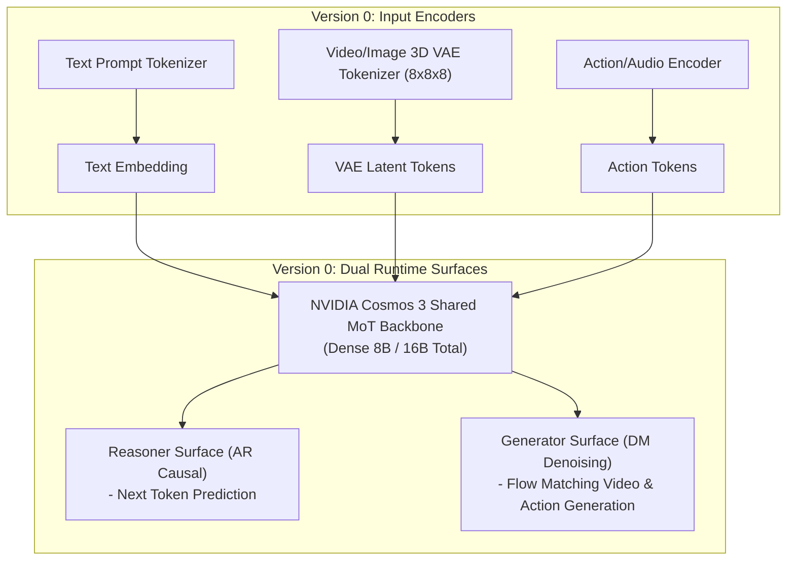
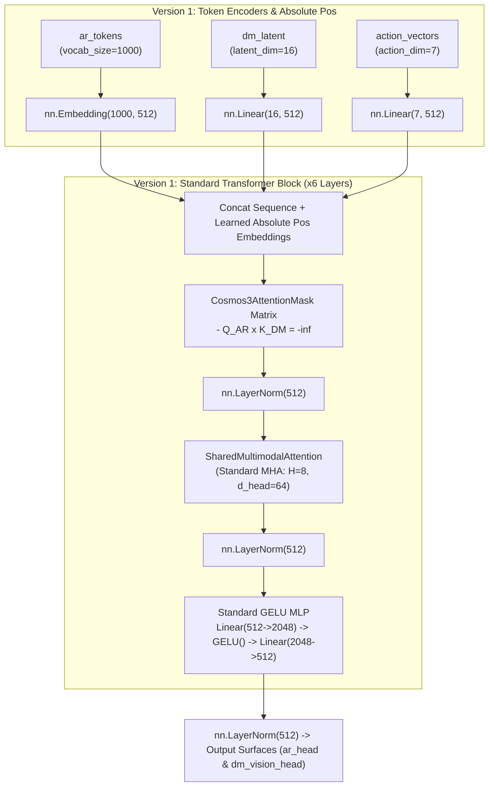
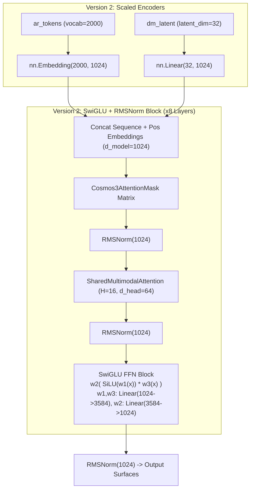
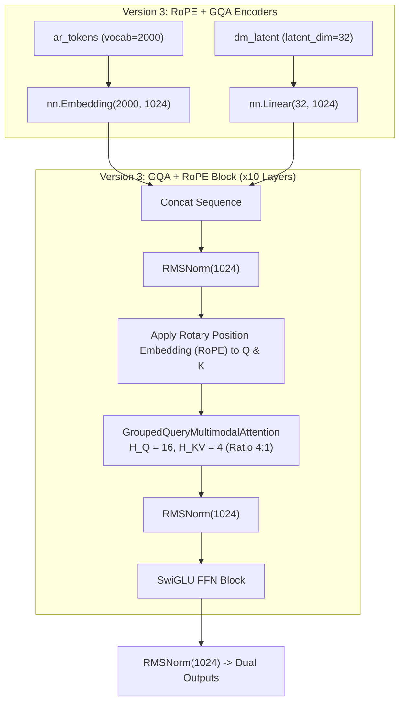
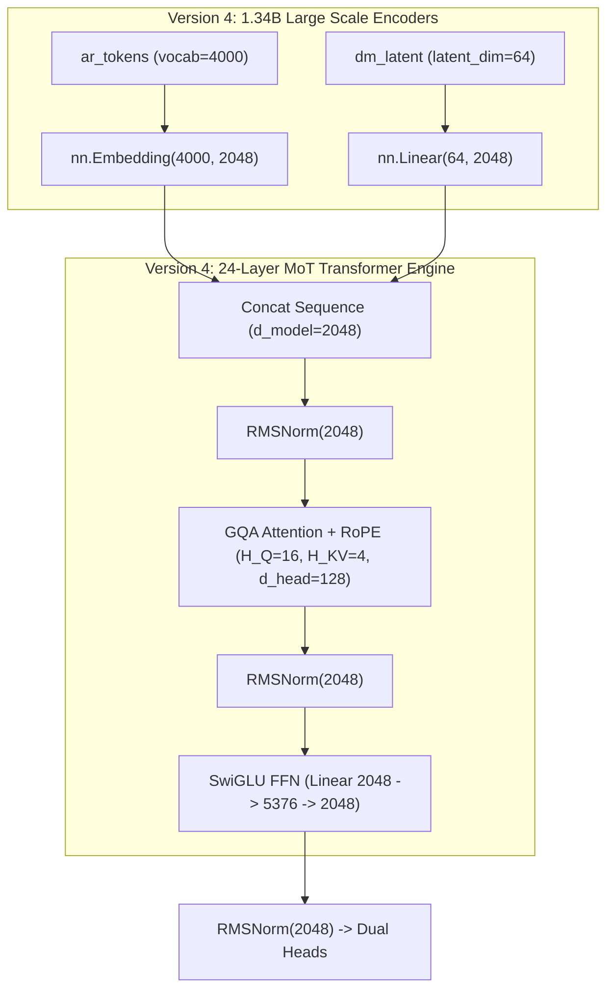
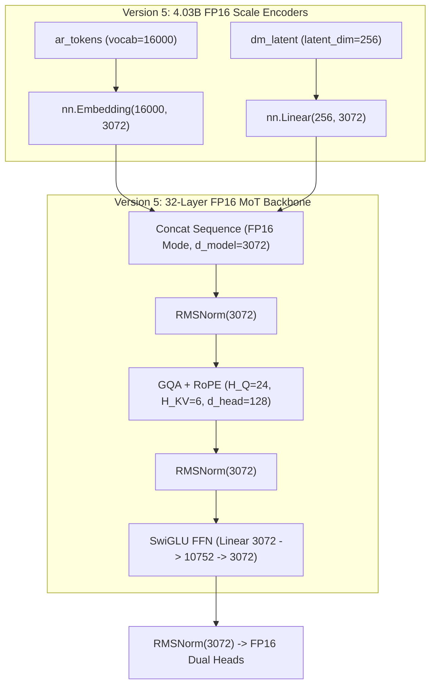
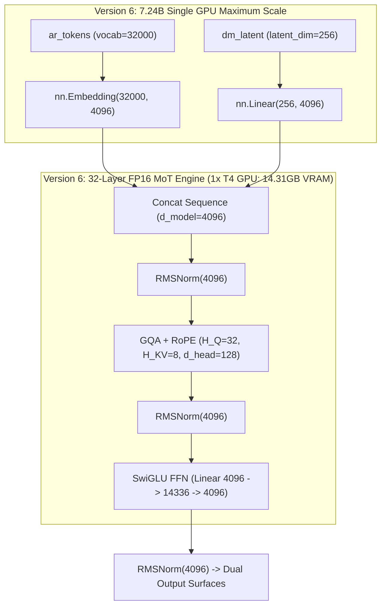
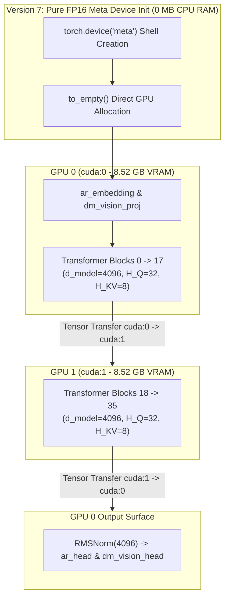

# BÁO CÁO ĐÁNH GIÁ VÀ SO SÁNH CÁC PHIÊN BẢN (VERSION COMPARISON REPORT)

> **Dự án:** `mini_cosmos` - Unified World Model Architecture Experiments  
> **Mục tiêu:** Đánh giá hiệu năng, mức tiêu thụ tài nguyên và độ chính xác kiến trúc giữa các phiên bản thử nghiệm.

---

## 1. Bảng So Sánh Tổng Quan (Benchmark Matrix)

| Thông Số Benchmark | Version 0 (Cosmos 3 Baseline) | Version 1 (Mini PoC) | Version 2 (Scaled) | Version 3 (GQA+RoPE) | Version 4 (1.34B) | Version 5 (4.03B FP16) | Version 6 (7.24B Max 1xT4) | Version 7 (8.12B Dual T4 FP16) |
| :--- | :---: | :---: | :---: | :---: | :---: | :---: | :---: | :---: |
| **Tổng Số Tham Số (Params)** | **16 B (8B Dense)** | **20.49 M** | **127.99 M** | **140.57 M** | **1,342.30 M** | **4,026.76 M** | **7,244.92 M (7.24B)** | **8,117.37 M (8.12B)** |
| **Số Lượng GPU Sử Dụng** | Datacenter | 1x GPU | 1x GPU | 1x GPU | 1x GPU | 1x GPU T4 | **1x GPU T4 (Max 98.2%)** | **2x GPU T4 (Dual GPU)** |
| **Kiểu Dữ Liệu (Precision)** | FP8 / BF16 | FP32 | FP32 | FP32 | FP32 | **FP16** | **FP16** | **FP16 (Pure GPU Direct Init)** |
| **Mức Tiêu Thụ VRAM Peak** | **~18,000 MB** | **139.78 MB** | **702.38 MB** | **810.40 MB** | **6,424.15 MB** | **8,443.60 MB** | **14,306.24 MB (14.31GB)** | **8,521.79 MB (8.52GB)** |
| **Độ Trễ Forward Pass (Latency)** | N/A | **5.27 ms** | **20.44 ms** | **23.09 ms** | **208.90 ms** | **69.62 ms** | **86.58 ms** | **102.22 ms** |
| **Thông Lượng (Throughput)** | N/A | **758.70 fps** | **195.74 fps** | **173.24 fps** | **19.15 fps** | **28.73 fps** | **11.55 fps** | **19.57 fps** |
| **AR Cross-Entropy Loss** | N/A | `7.1093` | `7.7275` | `7.7695` | `9.0605` | `9.9545` | `10.4755` | `82.4236` |
| **DM Reconstruction MSE Loss** | N/A | `1.2332` | `1.3119` | `1.4106` | `1.3204` | `1.3345` | `1.3359` | `399.7594` |
| **Attention Isolation ($Q_{AR} \times K_{DM} = 0$)** | **PASSED [OK]** | **PASSED [OK]** | **PASSED [OK]** | **PASSED [OK]** | **PASSED [OK]** | **PASSED [OK]** | **PASSED [OK]** | **PASSED [OK]** |

---

## 2. Chi Tiết Kiến Trúc Khối & Sơ Đồ Riêng Cho Từng Phiên Bản

---

### 2.1. Version 0 (`NVIDIA/Cosmos3-Nano`) - Sơ Đồ Kiến Trúc Chuẩn NVIDIA Gốc
- **Đặc điểm kiến trúc:**
  - Tokenizer 3D Causal VAE nén video 8x8x8 kết hợp Text Tokenizer và Action Encoders.
  - Lõi MoT hợp nhất luồng Autoregressive (AR) và Diffusion (DM).
  - Ma trận Attention Mask quy định chặt chẽ $Q_{AR} \times K_{DM} = -\infty$.



---

### 2.2. Version 1 (`mini_model/version1`) - Sơ Đồ Kiến Trúc PoC Thu Nhỏ (~20.5M Params)
- **Đặc điểm kiến trúc:**
  - Khởi tạo PoC cơ bản với `nn.Embedding` (1000, 512), `nn.Linear` (16/32/7, 512).
  - Sử dụng Learned Absolute Position Embeddings (1024 tokens).
  - Khối Transformer Block ($L=6, d_{model}=512, H=8$): **Standard LayerNorm** + **Standard Multi-Head Attention** + **GELU MLP** (`Linear(512->2048) -> GELU -> Linear(2048->512)`).



---

### 2.3. Version 2 (`mini_model/version2`) - Sơ Đồ Kiến Trúc Mở Rộng SwiGLU & RMSNorm (~128M Params)
- **Đặc điểm kiến trúc:**
  - Nâng cấp chiều ẩn $d_{model}=1024, L=8, H=16$.
  - Thay thế LayerNorm bằng **RMSNorm** (`x * rsqrt(var + eps) * weight`).
  - Thay thế GELU MLP bằng **SwiGLU FFN**: $W_2(\text{SiLU}(W_1 x) \odot W_3 x)$ với `mlp_ratio=3.5`.



---

### 2.4. Version 3 (`mini_model/version3`) - Sơ Đồ Kiến Trúc GQA & Position RoPE (~141M Params)
- **Đặc điểm kiến trúc:**
  - Thay thế vị trí tuyệt đối bằng **Rotary Position Embedding (RoPE)** áp dụng trực tiếp lên $Q$ và $K$.
  - Tích hợp **Grouped-Query Attention (GQA)** với $H_Q=16, H_{KV}=4$ (tỷ lệ nén GQA 4:1).



---

### 2.5. Version 4 (`mini_model/version4`) - Sơ Đồ Kiến Trúc Quy Mô Small LLM (~1.34B Params)
- **Đặc điểm kiến trúc:**
  - Mở rộng quy mô $d_{model}=2048, L=24, H_Q=16, H_{KV}=4$, SwiGLU intermediate dim = 5376.
  - Nâng `vocab_size`=4000, `latent_dim`=64.



---

### 2.6. Version 5 (`mini_model/version5`) - Sơ Đồ Kiến Trúc Quy Mô Cosmos 3 Edge FP16 (~4.03B Params)
- **Đặc điểm kiến trúc:**
  - Mở rộng quy mô $d_{model}=3072, L=32, H_Q=24, H_{KV}=6$, SwiGLU intermediate dim = 10752.
  - Vận hành chuẩn kiểu dữ liệu **FP16 Half Precision**.



---

### 2.7. Version 6 (`mini_model/version6`) - Sơ Đồ Kiến Trúc Quy Mô Cosmos 3 Nano Dense Backbone (~7.24B Params)
- **Đặc điểm kiến trúc:**
  - Mở rộng quy mô $d_{model}=4096, L=32, H_Q=32, H_{KV}=8$, `vocab_size`=32000.
  - Đạt mốc giới hạn tối đa VRAM trên 1 card GPU T4 (14.31 GB VRAM).



---

### 2.8. Version 7 (`mini_model/version7`) - Sơ Đồ Kiến Trúc Đa GPU Pipeline & Meta Direct Init (~8.12B Params)
- **Đặc điểm kiến trúc:**
  - **Meta Device Initialization (`torch.device('meta')`):** Khởi tạo mô hình 0 MB CPU RAM, sau đó `to_empty()` trực tiếp trên GPU VRAM.
  - **Device Pipeline Parallelism:**
    - `cuda:0` (GPU 0): Nạp `ar_embedding`, `dm_vision_proj`, và Blocks $0 \to 17$ (~8.52 GB VRAM).
    - `cuda:1` (GPU 1): Nạp Blocks $18 \to 35$, sau đó chuyển kết quả $h$ về `cuda:0` để qua `norm_f` và các Output Heads.



---

## 3. Quy Trình Chạy Benchmark Cho Các Phiên Bản

Để đo lường bất kỳ phiên bản nào trên Kaggle Notebook:

```bash
# Cập nhật repo từ GitHub
!git pull

# Chạy benchmark cho Version 7 trên Dual GPU T4
!python benchmark.py --version version7 --batch_size 2 --num_runs 50 --fp16 --multi_gpu
```
