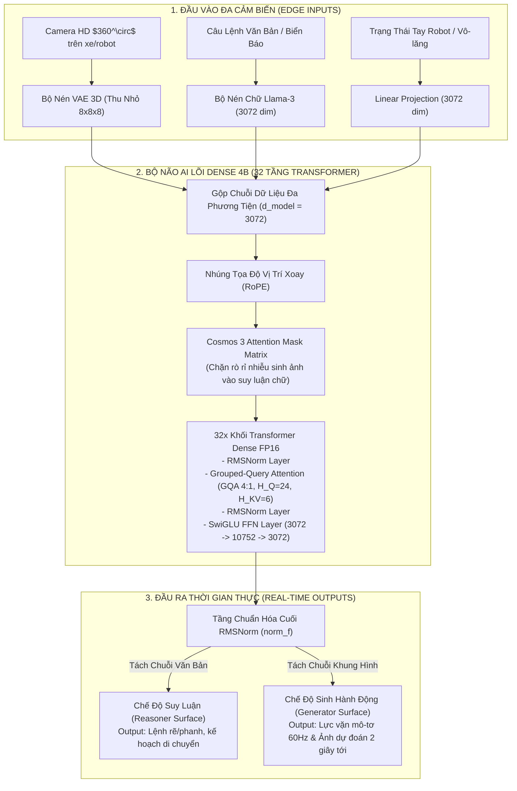
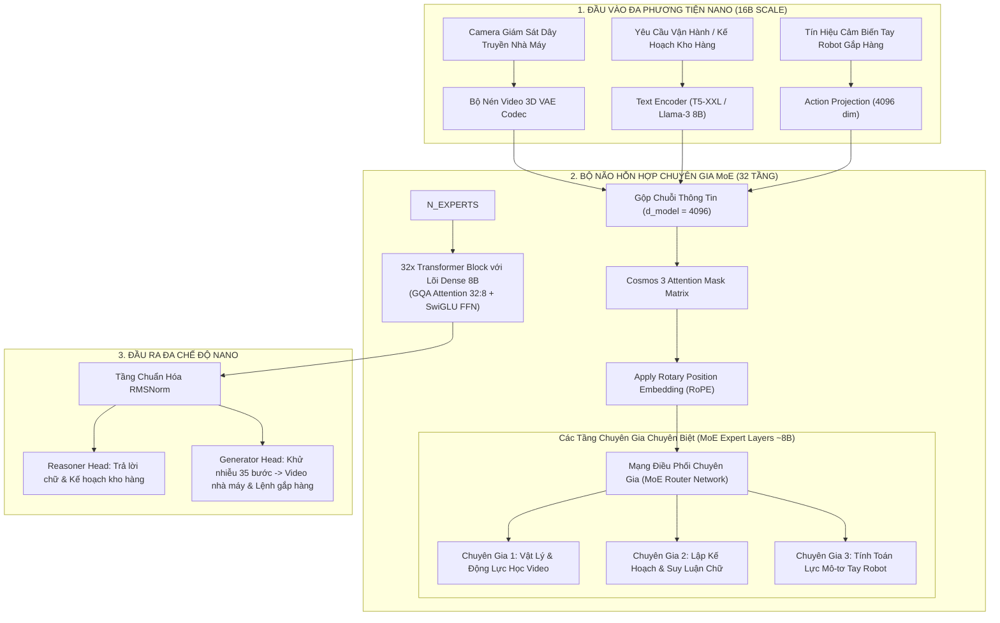
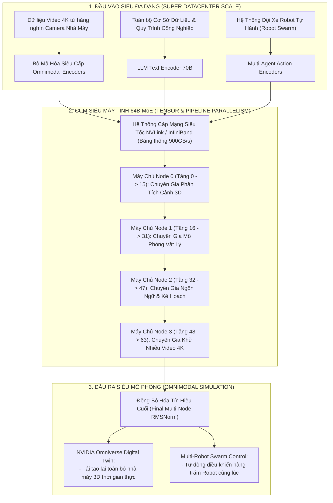

# KIẾN TRÚC TỔNG QUAN NỀN TẢNG NVIDIA COSMOS 3 (NVIDIA COSMOS 3 ARCHITECTURE GUIDE)

> **Tài liệu:** Tổng hợp sơ đồ khối kiến trúc của 3 dòng mô hình chính thuộc họ **NVIDIA Cosmos 3**: **Cosmos 3 Super (64B)**, **Cosmos 3 Nano (16B)**, và **Cosmos 3 Edge (4B)**.

---

## 1. Bảng So Sánh Tổng Quan 3 Mô Hình Cosmos 3

| Tiêu Chí Kỹ Thuật | **Cosmos 3 Edge (4B)** | **Cosmos 3 Nano (16B)** | **Cosmos 3 Super (64B)** |
| :--- | :---: | :---: | :---: |
| **Quy Mô Tham Số (Params)** | **4 Tỷ (4B Dense)** | **16 Tỷ (8B Dense + MoE Experts)** | **64 Tỷ (MoE Multi-Cluster)** |
| **Môi Trường Triển Khai** | Máy tính nhúng Xe tự hành & Robot | Server nội bộ nhà máy (On-Premise) | Siêu máy tính Trung tâm dữ liệu (Datacenter) |
| **Thiết Bị Phần Cứng Mục Tiêu** | NVIDIA DRIVE Thor / Jetson AGX Orin | 2x - 4x GPU T4 / A100 / H100 | Cụm máy chủ NVIDIA DGX H100 / B200 |
| **Dung Lượng VRAM Tiêu Thụ** | **~8.5 GB đến 12 GB VRAM** | **~16 GB đến 32 GB VRAM** | **~128 GB đến 256 GB VRAM** |
| **Tần Số Điều Khiển (Control Rate)** | **15 Hz - 60 Hz (Thời gian thực)** | **10 Hz - 20 Hz** | Khử nhiễu offline / Batch Processing |
| **Ứng Dụng Chính** | Tự lái xe, điều khiển robot tại chỗ | Quản lý kho hàng, suy luận nhà máy | Huấn luyện mô phỏng Digital Twin 3D |

---

## 2. Sơ Đồ Khối Kiến Trúc Chi Tiết Của 3 Mô Hình

---

### 2.1. Kiến Trúc COSMOS 3 EDGE (~4B Dense - Dành Cho Máy Tính Nhúng Xe Tự Hành & Robot)

* **Đặc điểm:** Kiến trúc thuần **Dense Backbone (4 Tỷ tham số)** nén chuẩn FP16, tối ưu cho các thiết bị Edge yêu cầu phản hồi tức thì dưới $30\text{ ms}$.

---

### 2.2. Kiến Trúc COSMOS 3 NANO (~16B Total - Dành Cho Máy Chủ Server Nội Bộ Nhà Máy)

* **Đặc điểm:** Kiến trúc kết hợp giữa **Lõi Trung Tâm 8B (Dense Backbone)** và các **Tầng Chuyên Gia MoE (Mixture-of-Experts ~8B)** giúp mở rộng tri thức nhà máy nhưng vẫn duy trì tốc độ xử lý nhanh.

---

### 2.3. Kiến Trúc COSMOS 3 SUPER (~64B MoE Multi-Cluster - Siêu Máy Tính Datacenter)

* **Đặc điểm:** Mô hình khổng lồ **64 Tỷ tham số** chạy trên cụm Siêu máy tính DGX H100/B200. Sử dụng kỹ thuật song song hóa đa máy chủ (Tensor Parallelism + Pipeline Parallelism) để mô phỏng toàn bộ không gian nhà máy 3D thời gian thực (Digital Twin).

---

## 3. Tóm Tắt Sự Khác Biệt Cốt Lõi Giữa 3 Mô Hình

1. **Cosmos 3 Edge (4B):**
   * **Bản chất:** Gọn nhẹ, thuần **Dense (không dùng MoE)** để triệt tiêu độ trễ truyền dữ liệu.
   * **Mục đích:** Gắn trực tiếp lên **Xe tự hành & Robot di động** để lái xe và gắp đồ thời gian thực.
2. **Cosmos 3 Nano (16B):**
   * **Bản chất:** Hỗn hợp **Lõi Dense 8B + Các Tầng Chuyên Gia MoE 8B**.
   * **Mục đích:** Đặt tại **Server nội bộ nhà máy** để quản lý kho hàng và giám sát an toàn dây chuyền.
3. **Cosmos 3 Super (64B):**
   * **Bản chất:** Siêu mô hình **MoE 64B** phân bổ qua cụm Siêu máy tính DGX.
   * **Mục đích:** Đặt tại **Trung tâm dữ liệu Cloud** để dựng mô phỏng 3D Digital Twin toàn bộ nhà máy.
