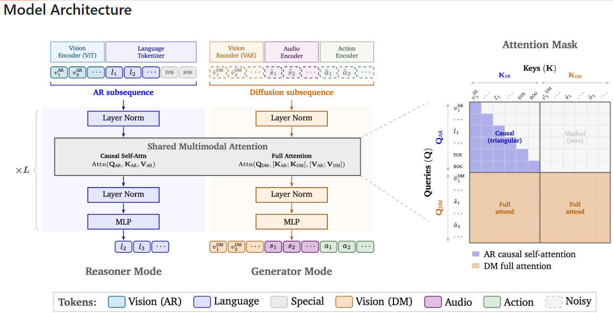

# BÁO CÁO KIẾN TRÚC MÔ HÌNH COSMOS 3 VÀ PHÂN TÍCH ỨNG DỤNG CÔNG NGHIỆP

---

## 1. Khái Quát Bối Cảnh Và Kiến Trúc Hợp Nhất Của Cosmos 3

**NVIDIA Cosmos 3** là dòng mô hình nền tảng đa thức (Omnimodal World Model) dành cho **Physical AI** (robotics, xe tự lái). Mô hình hợp nhất hai nhiệm vụ chính trong một kiến trúc **Mixture-of-Transformers (MoT)** duy nhất:
- **Tầng Tự Hồi Quy (AR Tower):** Đảm nhận nhận thức, định vị và suy luận logic (Perception & Reasoning).
- **Tầng Khuếch Tán (DM Tower):** Đảm nhận tạo mô phỏng và sinh nội dung đa phương tiện (Generation & Simulation).

---

### Sơ Đồ Kiến Trúc Chi Tiết



#### Công Dụng Cụ Thể Của Các Khối Trong Kiến Trúc:

1. **Khối Bộ Mã Hóa Đầu Vào (Input Encoders & Tokenizers):**
   - **Vision Encoder (ViT):** Chuyển đổi hình ảnh/frame đầu vào thành dạng token thị giác rời rạc phục vụ suy luận logic.
   - **Language Tokenizer:** Biến đổi văn bản hướng dẫn thành dạng token ngôn ngữ để mô hình tiếp nhận ngữ cảnh.
   - **Vision Encoder (VAE):** Trích xuất không gian nén (latent space) của video/hình ảnh chuẩn bị cho quá trình khuếch tán.
   - **Audio & Action Encoders:** Mã hóa tín hiệu âm thanh và chuỗi hành động điều khiển thiết bị thành dạng token phù hợp.

2. **Khối Xử Lý Trung Tâm (Shared Multimodal Attention & MLP):**
   - **Shared Multimodal Attention:** Khối chú ý đa phương tiện dùng chung, có công dụng kết nối thông tin giữa nhánh suy luận (AR) và nhánh sinh (DM), đảm bảo hình ảnh/video sinh ra bám sát logic ngữ cảnh.
   - **Layer Norm & MLP:** Chuẩn hóa dòng dữ liệu và biến đổi đặc trưng phi tuyến giúp mô hình học các đại diện ngữ nghĩa phức tạp.

3. **Khối Cơ Chế Phân Luồng Chú Ý (Attention Mask Matrix):**
   - **Luồng Tự hồi quy ($Q_{AR} \times K_{AR}$):** Giúp nhánh suy luận chỉ nhìn lại các dữ liệu quá khứ để dự đoán kết quả logic tiếp theo.
   - **Khối Cách ly Nhiễu ($Q_{AR} \times K_{DM}$):** Chặn tín hiệu nhiễu từ nhánh khuếch tán, bảo vệ khả năng suy luận logic không bị sai lệch.
   - **Khối Tổng hợp Ngữ cảnh ($Q_{DM} \times K_{AR} & K_{DM}$):** Cho phép nhánh sinh truy cập toàn bộ thông tin điều kiện từ văn bản/hình ảnh và tương tác giữa các thành phần (video, âm thanh, hành động) để tạo ra dữ liệu mô phỏng chân thực.

4. **Khối Đầu Ra (Dual Runtime Modes):**
   - **Reasoner Mode (Chế độ Suy luận):** Xuất câu trả lời văn bản, phân tích không gian hoặc kế hoạch hành động.
   - **Generator Mode (Chế độ Mô phỏng):** Xuất video/hình ảnh mô phỏng thế giới, âm thanh tương ứng và lệnh điều khiển robot thực tế.

---

## 2. Cấu Trúc Các Dòng Mô Hình Con Trong Dòng Cosmos 3

Họ mô hình Cosmos 3 được chia thành 3 kích thước mô hình chính nhằm đáp ứng các môi trường triển khai từ Datacenter đến thiết bị Biên (Edge):

| Tên Mô Hình | Dung Lượng Tham Số (Total / Dense Base) | Mục Đích Triển Khai | Phần Cứng Phù Hợp (Hardware Requirements) |
| :--- | :--- | :--- | :--- |
| **Cosmos 3 Super** | **64B** (Dense Base ~32B) | Siêu máy tính, Datacenter, sinh dữ liệu tổng hợp (synthetic data) chất lượng cao và suy luận thế giới phức tạp. | Cụm GPU Datacenter cỡ lớn: **NVIDIA Hopper H100 / H200**, **Blackwell B200**, các hệ thống DGX. |
| **Cosmos 3 Nano** | **16B** (Dense Base ~8B) | Môi trường Workstation, Server phục vụ suy luận nhanh và tạo mô phỏng thời gian thực cho nghiên cứu. | Workstation GPU cao cấp: **NVIDIA RTX PRO 6000 Ada**, **RTX 4090 / L40S**, hoặc cụm 1-2x H100. |
| **Cosmos 3 Edge** | **4B** (Dense Base ~2B) | Nhúng trên thiết bị biên (Edge Devices), ứng dụng điều khiển Robot realtime, xe tự hành. | Nền tảng máy tính biên / GPU cá nhân: **NVIDIA Jetson Thor**, **Jetson Orin**, hoặc GPU dòng RTX cá nhân. |

---

## 3. Lý Do Cosmos 3 Phù Hợp Nhất Cho Vận Hành Nhà Máy Công Nghiệp

### 3.1. Ưu Thế Về Mặt Kiến Trúc (Architectural Advantages)
- **Hợp nhất Suy luận Ngữ cảnh & Sinh Hành động Trực tiếp (Unified MoT):** 
  - *Chi tiết:* Trong nhà máy truyền thống, cần ghép nối 2 mô hình riêng (một mô hình VLM để hiểu hình ảnh và một mô hình điều khiển riêng cho robot), gây độ trễ lớn. Cosmos 3 gộp chung hai nhiệm vụ này vào một kiến trúc duy nhất.
  - *Lợi ích:* Ngay khi mô hình nhận diện sự cố qua camera, nó lập tức biến ngữ cảnh đó thành lệnh điều khiển chuyển động (Action Tokens) cho tay kẹp robot hoặc xe AMR với độ trễ cực thấp và tính đồng bộ cao.
- **Xử lý Đa phương tiện Nội tại (Native Omnimodal Processing):** 
  - *Chi tiết:* Kiến trúc tiếp nhận đồng thời 4 luồng dữ liệu đầu vào: Văn bản hướng dẫn, Video/Hình ảnh camera, Âm thanh cảm biến và Chuỗi hành động thiết bị.
  - *Lợi ích:* Trong môi trường nhà máy nhiều tiếng ồn và góc khuất, mô hình có thể kết hợp tiếng rít ma sát bất thường của máy móc (Audio) với hình ảnh quan sát (Vision) để chẩn đoán hỏng hóc sớm hơn nhiều so với hệ thống chỉ dùng hình ảnh.
- **Cơ chế Chặn Nhiễu Bảo vệ Logic An toàn (Safety-Critical Noise Isolation):** 
  - *Chi tiết:* Quá trình sinh hình ảnh/video mô phỏng (Diffusion) luôn chứa tín hiệu nhiễu ngẫu nhiên. Ma trận chú ý (Attention Mask) được thiết kế đặc biệt để chặn tuyệt đối các tín hiệu nhiễu này chảy ngược về nhánh suy luận logic.
  - *Lợi ích:* Đảm bảo tính an toàn nghiêm ngặt trong công nghiệp. Mô hình có thể tự do tạo video mô phỏng, nhưng quá trình ra quyết định và lập kế hoạch vận hành cho robot thật luôn giữ được độ chính xác, ổn định tuyệt đối và không bị sai lệch bởi hiện tượng "ảo giác" (hallucination).
- **Kiến trúc Đồng dạng Dễ Dàng Thu Nhỏ (Scalable Homogeneous Design):** 
  - *Chi tiết:* Khung xử lý của Cosmos 3 giữ nguyên cấu trúc phân luồng dữ liệu dù ở bất kỳ kích thước tham số nào.
  - *Lợi ích:* Giúp doanh nghiệp dễ dàng mang cùng một thuật toán điều khiển thử nghiệm từ Server trung tâm (bản 64B Super / 16B Nano) xuống cài đặt trực tiếp lên các máy tính nhúng nhỏ gắn trên robot tại dây chuyền (bản 4B Edge) mà không cần viết lại mã nguồn.

### 3.2. Hệ Sinh Thái Công Nghiệp Bổ Trợ (Industrial Ecosystem)
- **NVIDIA Omniverse (Digital Twin):** Mô phỏng lại toàn bộ nhà máy thực tế dưới dạng không gian 3D thời gian thực.
- **Isaac Sim / Isaac AMR:** Tương thích sẵn để huấn luyện robot công nghiệp và xe vận chuyển tự hành trong kho.
- **Metropolis:** Tích hợp hệ thống camera giám sát an toàn lao động và kiểm tra lỗi sản phẩm.

### 3.3. Các Khả Năng Độc Nhất (Unique Capabilities)
- **Sinh dữ liệu sự cố hiếm (Synthetic Data Generation):** Tự sinh video mô phỏng các tai nạn, hỏng hóc hiếm gặp để huấn luyện AI mà không gây rủi ro cho nhà máy thật.
- **Bảo mật On-Premise tuyệt đối (Open-Weights):** Cho phép tự triển khai hoàn toàn trên Server nội bộ nhà máy, bảo vệ 100% bí mật dây chuyền sản xuất (không phải đẩy dữ liệu lên Cloud API đóng).

---

## 4. So Sánh Mô Hình Gốc Cosmos3-Nano (BF16 Baseline) Với Các Biến Thể Lượng Hóa (Quantized Models trên HuggingFace)

Dựa trên danh sách các mô hình lượng hóa dành cho `nvidia/Cosmos3-Nano` (16B) trên HuggingFace (sử dụng NVIDIA TensorRT ModelOpt / AWQ), dưới đây là so sánh chi tiết giữa mô hình gốc (Baseline) và các phiên bản Quantized:

| Tiêu Chí | **Baseline Cosmos3-Nano (BF16/FP16)** | **Quantized FP8 (8-bit)** | **Quantized INT4 / NVFP4-AWQ (4-bit)** |
| :--- | :--- | :--- | :--- |
| **Dung lượng VRAM yêu cầu** | Rất lớn (**~32 GB – 35 GB VRAM**) | Trung bình (**~18 GB VRAM**) | Nhỏ (**~13 GB VRAM**) |
| **Khả năng tương thích GPU** | Cần cụm GPU Datacenter hoặc 2x GPU 24GB (A100/H100/RTX 4090x2) | Vừa trên **1x GPU RTX 4090 / L40S** (24GB VRAM) | **Vừa trực tiếp trên 1x GPU 16GB** (Tesla T4, RTX 4080, Jetson) |
| **Tốc độ suy luận (Throughput)** | Bị giới hạn bởi băng thông bộ nhớ (Memory Bandwidth Bound) | Tăng **1.5x – 2x** nhờ giảm khối lượng đọc/ghi VRAM | Tăng **2x – 3x** khi phục vụ bằng vLLM / TensorRT-LLM |
| **Độ chính xác / Suy hao chất lượng** | **Gốc (100% Precision)** | Hầu như không suy hao (**~99.5%** so với gốc) | Giữ chất lượng cao (**~97-98%**) nhờ kỹ thuật AWQ bảo vệ trọng số nhạy cảm |
| **Phương pháp nén** | Không nén trọng số | Lượng hóa FP8 qua TensorRT ModelOpt | AWQ (Activation-aware Weight Quantization) / NVFP4 (Blackwell-native) |

**Đánh giá ứng dụng:**
- Nếu môi trường triển khai có tài nguyên phần cứng hạn chế (GPU 16GB VRAM như Tesla T4 hay thiết bị nhúng), phiên bản **INT4 / NVFP4-AWQ** là giải pháp tối ưu giúp vận hành trực tiếp mô hình Cosmos3-Nano 16B mà không gặp lỗi tràn bộ nhớ (OOM).

---

## 5. Quy Trình Tổng Quát Tái Tạo Kiến Trúc Mô Hình Tương Tự Cosmos 3

Để xây dựng một mô hình thế giới đa thức (Omnimodal World Model) mang kiến trúc hợp nhất tương tự Cosmos 3 từ các thành phần mã nguồn mở sẵn có, quy trình triển khai tổng quát gồm 5 bước chính:

```
[Bước 1: Chọn Encoders Sẵn Có] -> [Bước 2: Xây Dựng Shared Backbone] -> [Bước 3: Cấu Hình Attention Mask]
                                                                                  |
[Bước 5: Đóng Gói Dual Runtime] <-------- [Bước 4: Huấn Luyện Hai Giai Đoạn] <----+
```

### Bước 1: Lựa Chọn Và Tận Dụng Các Bộ Mã Hóa (Encoders & Tokenizers) Sẵn Có
- **Vision AR Encoder:** Sử dụng bộ mã hóa thị giác ViT pre-trained mở (như SigLIP, CLIP hoặc EVA-CLIP) để biến hình ảnh thành các token rời rạc.
- **Language Tokenizer:** Tận dụng Tokenizer và Vocabulary của các mô hình LLM mở hàng đầu (như Qwen-2.5 hoặc Llama-3).
- **Vision VAE Encoder:** Sử dụng các bộ VAE nén video/ảnh mã nguồn mở (như SDXL VAE, SD3 VAE hoặc Wan2.1 VAE) để nén không gian latent.
- **Audio & Action Encoders:** Sử dụng bộ mã hóa âm thanh như Whisper/CLAP; dựng mạng MLP/Linear Projection đơn giản để chuyển véc-tơ chuyển động (Action Trajectory) thành chuỗi token.

### Bước 2: Xây Dựng Khối Backbone Dùng Chung (Shared Transformer Backbone)
- Dùng khung mã nguồn PyTorch / HuggingFace Transformers thiết lập chuỗi khối đồng dạng: $\text{LayerNorm} \rightarrow \text{Shared Attention} \rightarrow \text{MLP}$.
- Cài đặt **Grouped-Query Attention (GQA)** hoặc **Multi-Query Attention (MQA)** để tối ưu dung lượng bộ nhớ KV-Cache.
- Ghép nối các luồng token đầu vào thành một sequence chung gồm: `[Vision AR Tokens + Text Tokens]` cho nhánh AR và `[Latent VAE Tokens + Audio Tokens + Action Tokens]` cho nhánh DM.

### Bước 3: Cấu Hình Cơ Chế Phân Luồng Chú Ý (Attention Mask Matrix)
- Thiết lập lớp Attention Mask phân luồng trong PyTorch:
  - Khởi tạo **Causal Mask (tam giác dưới)** cho vùng tương tác giữa các token AR ($Q_{AR} \times K_{AR}$).
  - Gán giá trị **Zero Mask ($0$)** cho vùng tương tác từ $Q_{AR} \rightarrow K_{DM}$ để cách ly hoàn toàn nhiễu sinh ảnh khỏi nhánh suy luận.
  - Cho phép **Full Attention** đối với vùng tương tác từ $Q_{DM} \rightarrow [K_{AR}, K_{DM}]$.

### Bước 4: Huấn Luyện Hai Giai Đoạn (Two-Stage Training Recipe)
- **Giai đoạn 1 (Alignment & Pre-training AR):** Tải trọng số VLM/LLM sẵn có, đóng băng một phần bộ mã hóa và huấn luyện các lớp chiếu (Projection layers) để nhánh AR hiểu tốt ngữ cảnh văn bản và hình ảnh.
- **Giai đoạn 2 (Joint MoT & Diffusion Training):** Huấn luyện đồng thời cả nhánh AR và DM trên tập dữ liệu đa phương tiện (Video + Action + Audio). Sử dụng hàm mất mát kết hợp: **Cross-Entropy Loss** cho nhánh AR (dự đoán token văn bản/thị giác tiếp theo) và **Flow Matching / Diffusion Loss** cho nhánh DM (khử nhiễu video/hành động).

### Bước 5: Đóng Gói Hai Chế Độ Vận Hành (Dual Runtime Surfaces)
- **Reasoner Pipeline:** Đóng gói đường chạy suy luận chỉ kích hoạt nhánh AR để trả lời câu hỏi, phân tích không gian và lập kế hoạch hành động.
- **Generator Pipeline:** Đóng gói đường chạy sinh mô phỏng kích hoạt nhánh DM kết hợp với các bộ lấy mẫu (Sampler như Euler/DDIM) để sinh ra video, âm thanh và tín hiệu điều khiển robot thực tế.

---

## 6. Kết Luận

Kiến trúc **Cosmos 3** thể hiện bước tiến vượt bậc về việc hợp nhất suy luận nhận thức (AR) và sinh mô phỏng (Diffusion) trên một Transformer backbone dùng chung. Mô hình là giải pháp tối ưu hàng đầu cho vận hành nhà máy công nghiệp nhờ khả năng xử lý đa thức, cơ chế chặn nhiễu an toàn và hệ sinh thái Digital Twin mạnh mẽ. Đồng thời, thông qua quy trình tái tạo 5 bước bằng các thành phần mã nguồn mở và sự sẵn có của các phiên bản lượng hóa INT4-AWQ / FP8, việc phát triển và đưa các mô hình thế giới tương tự vào thực tế trở nên dễ dàng và tiết kiệm chi phí phần cứng đáng kể.
